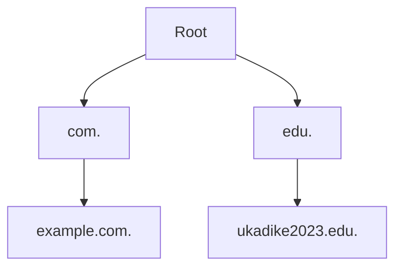

DNS is what maps a friendly website name like `www.google.com` to a number that computers can understand, like `216.58.223.196`. In other words, we can describe DNS as the phonebook of the internet.

### Setting up a DNS server

- ***Choose the DNS server software***: There are various DNS server software options available, such as Bind, PowerDNS, and Unbound. Select the one that best suits your requirements and operating system.

- ***Provision the server and install the DNS server software***: Prepare a server that will host the DNS server software. This server will have a static IP address.

- ***Configure the DNS server***: Configuration settings such as defining zones, setting up forwarders, and creating records should be done. It is also important to customize security settings.
  - ***Defining zones***: Each zone represents a domain name or a part of a domain name.
  - ***Setting up forwarders***: Forwarders are DNS servers to which your DNS server can send queries it cannot resolve.
  - ***Creating DNS records***: Domain names to IP addresses mappings are created in what is called a zone file. Types of DNS records that can be created in a zone file include:
    - A records for IPv4 addresses,
    - AAAA records for IPv6 addresses
    - MX records for mail servers
    - CNAME records for aliases

- ***Set up reverse DNS***: Reverse DNS does the opposite of DNS; it associates IP addresses with domain names.

<br>

In this post, I aim to document my findings and observations while performing a SEED Lab. This lab involves setting up a DNS infrastructure by configuring various nameservers plus the root servers. The DNS server software used is `BIND`.

The following outlines how the DNS infrastructure is organized:
- two root servers
- two com TLD servers
- one edu TLD server
- two 2LD nameservers



<br>

### Configure the Domain Nameserver
- with the bind server installed, edit `/etc/bind/named.conf.local` and put the following `include "/etc/bind/named.conf.zones"` in the file.
- create the file `/etc/bind/named.conf.zones`
- next in `/etc/bind/named.conf.zones`, define the zones.

  ```
  zone "ukadike2023.edu." {
    type master; #type of server
    file "/etc/bind/zones/ukadike2023.edu"; #location of zone file
    allow-update { any; }; #specifies restrictions update to zone records
  };
  ```
  
  - `allow-update { any; };` grants unrestricted access to update the zone records. This level of access allows any client to update a zone. The best practice is to restrict update access to specific IP addresses to ensure the security and integrity of the DNS zone file.
    
- create the zone file `/etc/bind/zones/ukadike2023.edu` and populate its contents.

  ```
  $TTL 5m ; 5 mins
  $ORIGIN ukadike2023.edu.
  @       SOA     ns1.ukadike2023.edu. admin.ukadike2023.edu. (
                          2023063001 ; serial number
                          15m        ; refresh
                          15m        ; retry
                          30m        ; expire
                          5m )       ; negative caching TTL
  
  @       NS      ns1.ukadike2023.edu.
  
  ns1.ukadike2023.edu.    IN      A       10.162.0.73
  www                     IN      A       10.162.0.74
  mail                    IN      A       10.162.0.75
  *                       IN      A       10.162.0.76
  ```

  - $TTL specifies how long the record can be cached. In the above, it is set to 5 minutes (300 seconds).
 
  - $ORIGIN specifies the domain name that the zone file is associated with
 
  - SOA (Start of Authority) specifies administrative information about the zone. It includes the following:
    - the primary nameserver
    - the contact information of the person responsible for managing the domain
    - serial number, which indicates the version of the zone file. It is usually incremented every time the zone file is modified. The serial number is primarily used for zone transfer and to synchronize data between DNS servers.
    - refresh defines how often secondary nameservers should query primary nameservers for zone updates.
    - retry defines how long secondary nameservers should wait before retrying a failed zone transfer or update request to the primary nameserver.
    - expire defines how long secondary nameservers should treat the cached zone data as valid if they cannot reach the primary nameserver.
    - negative TTL specifies how long the nameserver should remember that a record was not found. This prevents the nameserver from constantly querying non-existent results.

  - @ specifies the current zone being defined. In this case, it is ukadike2023.edu.
 
- restart the nameserver `service named restart`

***querying the nameserver for `www.ukadike2023.edu`***


***querying the nameserver for `lofi.ukadike2023.edu`***


<br>

### Configure the TLD servers
All the nameservers within a TLD domain must register their nameservers on the same TLD server. This means ukadike2023.edu. must register with the .edu. TLD server. We need to add two records in the .edu. server’s zone file:
- a NS record that specifies the nameserver for the ukadike2023.edu domain
- an A record that specifies the IP address of the nameserver.

- edit `/etc/bind/named.conf.local` and put the following `include "/etc/bind/named.conf.zones"` in the file.
- create the file `/etc/bind/named.conf.zones`
- next in `/etc/bind/named.conf.zones`, define the zones.
- create the zone file `/etc/bind/zones/edu` and populate its contents.

  ```
  $TTL 5m ; 5 mins
  $ORIGIN edu.
  @       SOA     ns1.edu. admin.edu. (
                          2385852390 ; serial number
                          15m        ; refresh
                          15m        ; retry
                          30m        ; expire
                          5m )       ; negative caching TTL
  
  @                     NS      ns1.edu.
  ukadike2023.edu.      NS      ns1.ukadike2023.edu.
  
  ns1.edu.                     IN      A       10.152.0.71
  ns1.ukadike2023.edu.         IN      A       10.162.0.73
  ```

- restart the nameserver `service named restart`

***querying the TLD for `www.ukadike2023.edu`***


From the screenshot above, the TLD cannot provide an answer because it does not have one, but it provides the authority record that contains the answer.

<br>

### Configure the Root servers
All TLD nameservers must register with the root server. This means the edu. TLD must register with the root servers. We need to add two records in the root server’s zone file:
- a NS record that specifies the nameserver for the edu TLD domain
- an A record that specifies the IP address of the nameserver.

- edit `/etc/bind/named.conf.local` and put the following `include "/etc/bind/named.conf.zones"` in the file.
- create the file `/etc/bind/named.conf.zones`
- next in `/etc/bind/named.conf.zones`, define the zones.
- create the zone file `/etc/bind/zones/root` and populate its contents.

    ```
    $TTL 5m ; 5 mins
    $ORIGIN .
    @       SOA     ns1. admin. (
                            412927636 ; serial number
                            15m       ; refresh
                            15m       ; retry
                            30m       ; expire
                            5m )      ; negative caching TTL
    
    @         NS      ns1.
    @         NS      ns2.
    com.      NS      ns1.com.
    com.      NS      ns2.com.
    edu.      NS      ns1.edu.
    
    ns1.            IN      A      10.150.0.72
    ns2.            IN      A      10.160.0.72
    ns1.com.        IN      A      10.151.0.72
    ns2.com.        IN      A      10.161.0.72
    ns1.edu.        IN      A      10.152.0.71
    ```

- restart the nameserver `service named restart`

<!--
**querying the root server for `www.ukadike2023.edu`**


**querying the root server for `fakedomain.ukadike2023.edu`**


-->

***querying the root server for `fakedomain.ukadike2023.edu`***


From the screenshot above, the root server provides an authority record that contains the server that can answer the question about the edu domain.

<br>

### Configure the Local DNS Server
The local DNS server, also called a DNS resolver, is the first point of contact for computers when performing name resolution. The DNS resolver conducts the entire DNS resolution process. While TLD servers and root servers are non-recursive, the DNS resolver is recursive. The whole recursive process must start with querying the root servers; thus, DNS resolvers must know the IP addresses of the root servers. The details of these root servers are stored in a file called `root.hints.

<br>

### Configure the Client
Though the DNS servers are setup, the computer will still not know how to contact the DNS resolver. However, the computer maintains a file where it keeps the addresses of DNS resolvers: `/etc/resolv.conf`. By adding the DNS resolver's IP address as the first entry in this file, the computer uses it as its primary DNS resolver.

***DNS query for `www.ukadike2023.edu` on the client***


***DNS query for `love.ukadike2023.edu` on the client***


From the screenshot, everything works as expected and the queries get resolved without issues.

<br>

### Reverse DNS Lookup
Reverse DNS lookup helps us identify the domain name that is associated with an IP address. For Reverse DNS lookup to work, reverse lookup resolution must be configured.

**step one**

- The root servers need to host the NS records for the in-addr.arpa zone
- As this is a small infrastructure, we can edit the zone files on the root server and add the entry for in-addr.arpa
  
    ```
    $TTL 5m ; 5 mins
    $ORIGIN .
    @       SOA     ns1. admin. (
                            412927636 ; serial number
                            15m       ; refresh
                            15m       ; retry
                            30m       ; expire
                            5m )      ; negative caching TTL
    
    @         NS      ns1.
    @         NS      ns2.
    com.      NS      ns1.com.
    com.      NS      ns2.com.
    edu.      NS      ns1.edu.
    
    in-addr.arpa.    NS    ns1.com
    in-addr.arpa.    NS    ns2.com
    in-addr.arpa.    NS    ns1.edu
    
    ns1.            IN      A      10.150.0.72
    ns2.            IN      A      10.160.0.72
    ns1.com.        IN      A      10.151.0.72
    ns2.com.        IN      A      10.161.0.72
    ns1.edu.        IN      A      10.152.0.71
    ```

- restart the nameserver `service named restart`

**Step two**

- configure the in-addr.arpa nameserver. This lab makes use of the TLD nameserver.
- add a zone entry in the TLD's /etc/bind/named.conf.zones 
 
    ```
    zone "in-addr.arpa." {
      type master;
      notify yes;
      allow-transfer { any; };
      allow-update { any; };
      file "/etc/bind/zones/in-addr.arpa.";
    };
    ```

- then create `/etc/bind/zones/in-addr.arpa` and populate the necessary records
  
    ```
    $TTL 5m
    $ORIGIN in-addr.arpa.
    @       SOA     ns1.edu. admin.edu. (
                            2385852390 ; serial number
                            15m        ; refresh
                            15m        ; retry
                            30m        ; expire
                            1m )       ; negative caching TTL
    
    @                     NS      ns1.edu.
    162.10.in-addr.arpa.  NS      ns1.ukadike2023.edu.
    
    ns1.edu.                    IN      A      10.152.0.71
    ns1.ukadike2023.edu.        IN      A      10.162.0.73
    ```

- restart the nameserver `service named restart`

**step three**

- configure the 162.10.in-addr.arpa nameserver. This lab makes use of the ukadike2023.edu nameserver.
- add a zone entry in ukadike2023.edu's /etc/bind/named.conf.zones 

    ```
    zone "162.10.in-addr.arpa." {
        type master;
        file "/etc/bind/zones/162.10.in-addr.arpa.";
        allow-update { any; };
    };
    ```

- then create `/etc/bind/zones/162.10.in-addr.arpa` and populate the necessary records

    ```
    $TTL 5m
    $ORIGIN 162.10.in-addr.arpa.
    @       SOA     ns1.ukadike2023.edu. admin.ukadike2023.edu. (
                            2023063001 ; serial number
                            15m        ; refresh
                            15m        ; retry
                            30m        ; expire
                            1m )       ; negative caching TTL
    
    @       NS      ns1.ukadike2023.edu.
    ns1.ukadike2023.edu.    IN    A    10.162.0.73
    
    73.0    IN      PTR     ns1.ukadike2023.edu.
    74.0    IN      PTR     www.ukadike2023.edu.
    75.0    IN      PTR     mail.ukadike2023.edu.
    ```

- restart the nameserver `service named restart`

***performing reverse lookup on IP address of `ns1.ukadike2023.edu`***


***performing reverse lookup on IP address of `www.ukadike2023.edu`***


***performing reverse lookup on IP address of an unmapped IP address***


<br>

If you are interested in adding security to the DNS setup, kindly checkout a [follow up post](../2023-06-30-dns-infrastructure.md) that builds upon this post.

_Thanks for reading_


